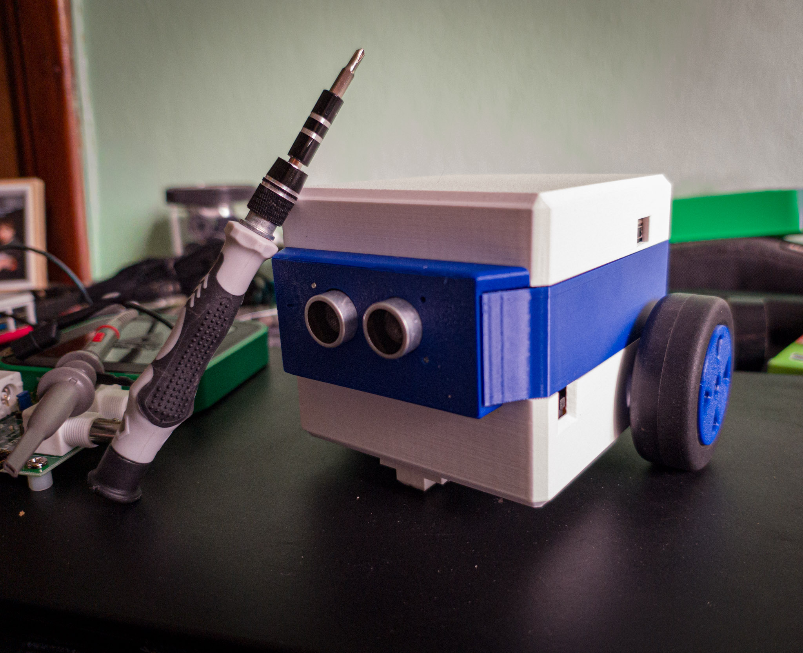

# Abbott the Robot



Welcome to the official firmware repository for **Abbott the Robot**, an educational and hobbyist mobile robot platform! Abbott is designed to be an accessible, 3D-printable, and highly customizable introduction to embedded systems and robotics. 

This repository contains the C/C++ firmware built around the powerful ARM Cortex-M4 **STM32F411** microcontroller, utilizing the STM32 HAL (Hardware Abstraction Layer).

---

## Features

Abbott comes packed with features perfect for learning autonomous navigation, sensor integration, and motor control:

* **Differential Drive System:** Independent control of two DC gear motors for precise steering and speed regulation via PWM.
* **Obstacle Avoidance:** Integrated HC-SR04 Ultrasonic distance sensor for scanning the environment and preventing collisions.
* **Line Following Capabilities:** Two downward-facing IR sensors for track navigation and edge detection.
* **Audio Feedback:** A piezo buzzer programmed to play simple melodies and emit status alerts (e.g., startup sequence, error states).
* **Visual Indicators:** LED lights for debugging and aesthetic feedback.

---

## Hardware Requirements

To build and run Abbott, you will need the following core components:

* **CPU / Microcontroller:** STM32F4xx Development Board (e.g., STM32F411RTE Nucleo-64 board or similar)
* **Motors:** Two [modified](https://archive.seattlerobotics.org/guide/servohack.html) futaba S3003 servos
* **Sensors:**
    * 1x HC-SR04 Ultrasonic Distance Sensor or Seeedstudio Grove sensor (1-pin trigger / reception)
    * 2x IR Line Tracking Sensors (TCRT5000 modules)
* **Feedback:** Piezo buzzer (passive)
* **LEDs:** Neopixel round 16/12 bit RGB led strip
* **Power:** Two 18650 3.7V batteries in series to power all the system.

---

## Configuration

*Note: Comming*

| Component | STM32 Pin | Function / Peripheral |
| :--- | :--- | :--- |
| **Feature** | `PA0` | GPIO Output |

---

## Software Setup & Installation

This project is configured using **STM32CubeIDE**. 

### Prerequisites
1. Download and install [STM32CubeIDE](https://www.st.com/en/development-tools/stm32cubeide.html).
2. You will need an ST-Link V2 (or compatible) programmer to flash the board.

### Building the Firmware
1. **Clone the repository:**
   ```bash
   git clone https://github.com/ingflanza/AbbottRobot.git
